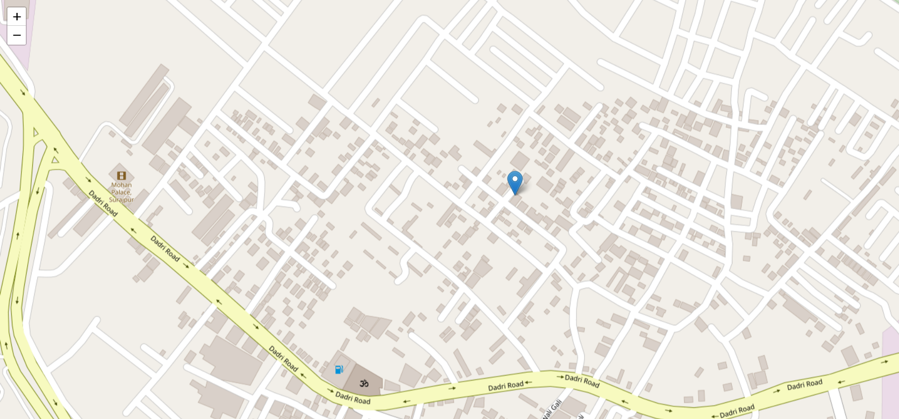

# RealTime Location Tracker
### hey everyone this is a real time location tracker webapp.
- used to tracks the current locations of connected devices 

## Dependencies

| Package     | Version  |
|------------|----------|
| ejs        | ^3.1.10  |
| express    | ^4.21.2  |
| nodemon    | ^3.1.9   |
| socket.io  | ^4.8.1   |
| leaflet    | latest   |

## Installation

To install these dependencies, run the following command:

```sh
npm install
```

Alternatively, you can install them individually:

```sh
npm install ejs@^3.1.10 express@^4.21.2 nodemon@^3.1.9 socket.io@^4.8.1 
```

## Description

- **EJS**: Embedded JavaScript templates for rendering dynamic content in views.
- **Express**: A fast, minimalist web framework for Node.js.
- **Nodemon**: A utility that monitors for file changes and automatically restarts the server.
- **Socket.io**: A library for real-time, bidirectional communication between clients and servers.
- **Leaflet**: A JavaScript library for interactive maps.

## Real Location Tracker

Using **Leaflet** and **Socket.io**, you can build a real-time location tracking system. This allows users to share their live location on an interactive map.

## Usage

- **Start the server with Nodemon:**
  ```sh
  npx nodemon server.js
  ```
- **Run the server normally:**
  ```sh
  node server.js
  ```

- **Implement a real-time location tracker using Leaflet:**
  1. Set up a map with Leaflet.
  2. Use Socket.io to transmit live location data.
  3. Display the real-time location updates on the map.


## pictorial view of website
